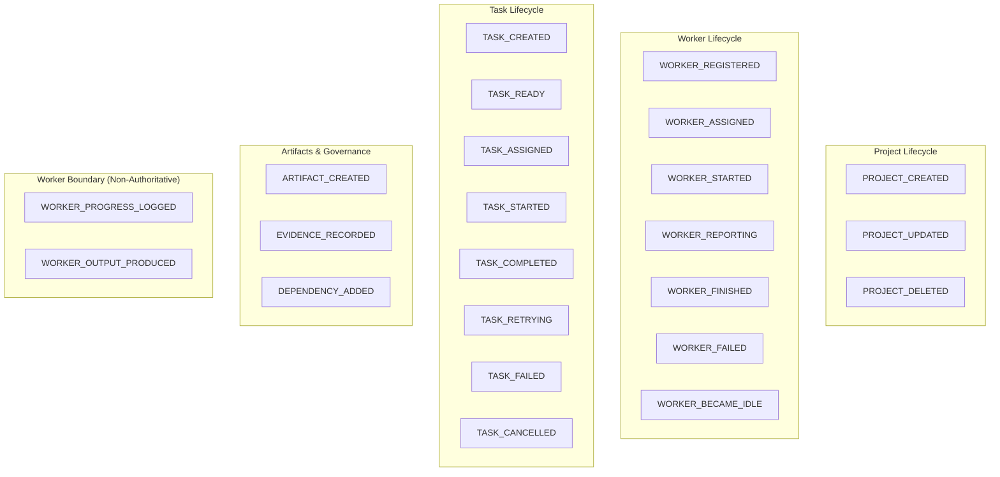

# AutonomOS — Stage 2 Event & Activity System Specification & Documentation

## 1. Executive Summary & Core Philosophy

Stage 2 establishes the **Event & Activity System** for AutonomOS. The event system is the historical nervous system of the platform, recording what the runtime deterministically did rather than what an AI claims happened.

### Core Guarantees
1. **Historical Immutability**: Events represent historical facts. Once appended, an event cannot be edited or deleted.
2. **Authoritative vs. Non-Authoritative Separation**: Authoritative state transitions (`TASK_STARTED`, `TASK_COMPLETED`, `WORKER_ASSIGNED`) are emitted strictly by the runtime. Worker progress logs and self-attestations are explicitly wrapped as `WORKER_PROGRESS_LOGGED` with `source="WORKER"`.
3. **Correlation & Causation**: Every event belongs to a logical execution trace (`correlation_id`) and explicitly points to the direct parent event that triggered it (`causation_id`).
4. **Deterministic Global Ordering**: Events are ordered using monotonic integer `sequence_number` values in addition to ISO 8601 UTC timestamps.
5. **Product Activity Projection**: Developer-level technical event streams are projected into human-friendly `ActivityItem` instances for consumption by UI surfaces (Chat, Task Timelines, Home Dashboard, and the Flutter app).

---

## 2. Event Model & Schema

Every event recorded by AutonomOS conforms to the following schema:

```json
{
  "event_id": "evt-550e8400-e29b-41d4-a716-446655440000",
  "sequence_number": 42,
  "event_type": "TASK_STARTED",
  "timestamp": "2026-08-26T18:05:00.123456Z",
  "source": "RUNTIME",
  "correlation_id": "task-001",
  "causation_id": "evt-123e4567-e89b-12d3-a456-426614174000",
  "project_id": "proj-demo-1",
  "task_id": "task-001",
  "worker_id": "worker.dummy.primary",
  "artifact_id": null,
  "schema_version": 1,
  "payload": {
    "title": "Generate Hello Artifact",
    "attempt": 1
  },
  "metadata": {}
}
```

### Field Definitions

| Field | Type | Description |
| :--- | :--- | :--- |
| `event_id` | `string` | Unique, permanent event identifier prefixed with `evt-`. |
| `sequence_number`| `integer` | Monotonically increasing global sequence number for absolute ordering. |
| `event_type` | `enum` | Typed event identifier from the authoritative taxonomy. |
| `timestamp` | `string` | ISO 8601 UTC timestamp. |
| `source` | `enum` | `SYSTEM`, `RUNTIME`, `TASK_ENGINE`, `WORKER`, `USER`. |
| `correlation_id`| `string` | Identifies the end-to-end logical execution chain (e.g. `task_id` or `goal_id`). |
| `causation_id` | `string?` | The `event_id` of the direct cause that triggered this event. |
| `project_id` | `string?` | Associated project workspace. |
| `task_id` | `string?` | Associated task. |
| `worker_id` | `string?` | Associated worker. |
| `artifact_id` | `string?` | Associated artifact. |
| `payload` | `object` | Structured, event-specific payload. |
| `schema_version`| `integer` | Schema evolution version number (default `1`). |

---

## 3. Event Taxonomy & Semantics



---

## 4. Causation Chains & Lineage Reconstruction

When an operation triggers subsequent actions, AutonomOS links each new event to its trigger via `causation_id`. The runtime provides `get_causal_chain(event_id)` which walks backwards through parent IDs to reconstruct the full root-cause trajectory:

```
[TASK_ASSIGNED] (evt-1)
       │ (causes)
       ▼
[TASK_STARTED] (evt-2)
       │ (causes)
       ▼
[ARTIFACT_CREATED] (evt-3)
       │ (causes)
       ▼
[TASK_COMPLETED] (evt-4)
       │ (causes)
       ▼
[TASK_READY for downstream Task 2] (evt-5)
```

---

## 5. Activity Feed Projections

The technical event log is projected into human-friendly `ActivityItem` representations for consumption by UI surfaces:

```python
# Project an event into a UI-ready activity item
activity = ActivityProjector.project(event)
print(activity.title)       # "Task 'task-001' completed successfully"
print(activity.icon)        # "task_success"
print(activity.level)       # ActivityLevel.SUCCESS
```

### Developer CLI Formatting
For rapid local inspection during development:
```
[18:05:00] #0001 [PROJECT_CREATED] — 'AutonomOS Demo Project'
[18:05:00] #0002 [WORKER_REGISTERED] worker=worker.dummy.primary
[18:05:00] #0003 [TASK_CREATED] task=task-001 — 'Generate Hello Artifact'
[18:05:00] #0004 [TASK_ASSIGNED] task=task-001 worker=worker.dummy.primary
[18:05:00] #0005 [TASK_STARTED] task=task-001 worker=worker.dummy.primary — 'Generate Hello Artifact'
[18:05:00] #0006 [ARTIFACT_CREATED] task=task-001 artifact=art-001 — path: hello.txt
[18:05:00] #0007 [TASK_COMPLETED] task=task-001 worker=worker.dummy.primary — DummyWorker successfully executed
[18:05:00] #0008 [TASK_READY] task=task-002 — reason: Prerequisite task-001 completed
```

---

## 6. Persistence & Durability

Events are stored in the embedded SQLite database (`events` table) with WAL mode enabled.
- **Append-Only Enforcement**: Re-inserting an existing `event_id` raises a `PersistenceError`.
- **Process Restart Durability**: Restarting the application reloads the entire event store with zero loss of sequence ordering, timestamps, payloads, or causal relations.

---

## 7. Verification & Test Suite Summary

```bash
$ python3 -m unittest discover -s test -p "test_*.py" -v
Ran 42 tests in 0.292s.
OK
```

### Tests Added in Stage 2
1. `test_events.py`: Model creation, JSON serialization/deserialization, SQLite & Memory event appending, monotonic sequence numbering, duplicate ID immutability rejection, and causal chain reconstruction.
2. `test_activity_projection.py`: Projection of technical events to human-readable UI activity items, icon mappings, and CLI debug formatting.
3. `test_event_integrity.py`: Live event subscription, failure event recording (`TASK_RETRYING`, `TASK_FAILED`), and isolation of worker progress logs from authoritative state.
4. `test_end_to_end_golden_path.py`: Extended to verify complete chronological timeline generation and SQLite durability across process restart.
